<p align="center">
  <strong>-------></strong> 
  <a href="/README_en_EN.md">English</a> | 
  <a href="/README.md">Русский</a> 
  <strong><-------</strong>
</p>

<p align="center">
  <picture>
    <source media="(prefers-color-scheme: dark)" srcset="./media/logo-dark.png">
    
  </picture>
</p>

<p align="center">
  <picture>
    <source media="(prefers-color-scheme: dark)" srcset="./media/steamworks-logo-dark.png">
    
  </picture>
</p>

---

<div align="center">

[](https://github.com/AnikBeris)
[](/LICENSE.md)
[](https://github.com/AnikBeris)

</div>


<h1 align="center">Steam Achievements In Unreal Engine 5 ( Tutorial )</h1>

<h2 align="center">
Этот простой способ подключения Steam Achievements, Steam Leaderboard и Steam Stat без сторонних плагинов.
</h2>

<h2 align="center">
Он предназначен для упрощения выдачи наград, связанных с внутриигровыми заданиями.
</h2>

* * * * * * * * * * * * * * * * * * 
* * * * * * * * * * * * * * * * * * 


> **⚠️ Внимание отказ от ответственности:** Автор не несёт ответственности за возможные последствия.

**Если этот проект оказался полезным для Вас, вы можете оценить его, поставив звёздочку.**:star2:

<p align="left">
  <a href="https://pay.cloudtips.ru/p/7249ba98" target="_blank">
    
  </a>
</p>

Пожертвования горячо приветствуются, какими бы маленькими они ни были, и большое спасибо. 😌

| | |
|-------------:|:-------------|
| **Tether USDT (BEP20)** |`0x22258ea591966e830199d27dea7c542f31ed5dc5`|
| **Bitcoin (BTC)** |`1Dbwq9EP8YpF3SrLgag2EQwGASMSGLADbh`|
| **Ethereum (ERC20)** | `0x22258ea591966e830199d27dea7c542f31ed5dc5`|
| **Binance Smart Chain (BEP20)** | `0x22258ea591966e830199d27dea7c542f31ed5dc5`|
| **Solana (SOL)** | `yYYXsiVTzsvfvsMnBxfxSZEWTGytjAViE2ojf3hbLeF`|
| **Cloud tips** | [cloudtips](https://pay.cloudtips.ru/p/7249ba98) |
| | |


* * * * * * * * * * * * * * * * * * 
* * * * * * * * * * * * * * * * * * 


## 📚 Содержание

1. [Введение](#-введение)
2. [Настройка статистики](#-1-настройка-статистики)
3. [Создание таблицы лидеров](#-2-создание-таблицы-лидеров)
4. [Настройка достижений](#-3-настройка-достижений)
5. [Чертёж логики (Blueprint)](#-4-чертёж-логики-blueprint)
6. [Чтение и работа со статистикой](#-5-чтение-и-работа-со-статистикой)
7. [Сброс статистики и достижений](#-6-сброс-статистики-и-достижений)
8. [Кодовая часть в Unreal Engine 5 (Blueprints)](#-7-кодовая-часть-в-unreal-engine-5-blueprints)
9. [Заключение](#-8-заключение)


## 🔗 Полезные ссылки
- [Статистика и достижения](https://partner.steamgames.com/doc/features/achievements#1)
- [AVGRATE-статистика](https://partner.steamgames.com/doc/features/achievements#AVGRATE)
- [Сброс статистик](https://partner.steamgames.com/doc/features/achievements#9)
- [Общая статистика](https://partner.steamgames.com/doc/features/achievements#global_stats)
- [Достижения](https://partner.steamgames.com/doc/features/achievements/ach_guide)
- [Статистики](https://partner.steamgames.com/doc/features/achievements/stats_guide)

* * * * * * * * * * * * * * * * * * 
* * * * * * * * * * * * * * * * * * 


# История о том, как я настраиваю достижения, статистику и таблицы лидеров в Steamworks


## Статистика первой настройки выглядит так:

<details>
    <summary>⚠️ ОПИСАНИЕ: </summary>

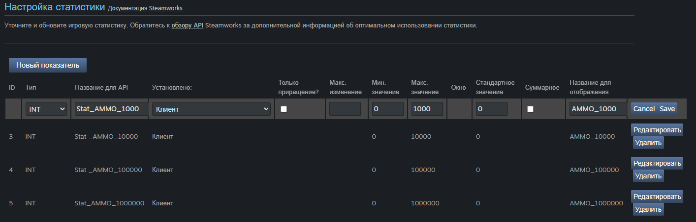

Название таблицы статистики должно начинаться на `« Stat »` ( рекомендуется делать числовым и по убыванию но не обязательно ).

- При создании статистики вы увидети следующие графы:
  - **ID** — автоматически генерируемый номер для каждого достижения.
  - **Type** — INT, FLOAT или AVGRATE.
  - - **INT** — 32-битное целое число со знаком (к примеру, число сыгранных игр).
  - - **FLOAT** — 32-битное число с плавающей точкой (к примеру, число пройденных автомобилем миль).
  - - **AVGRATE** — скользящее среднее. См. раздел [«AVGRATE-статистика»](https://partner.steamgames.com/doc/features/achievements#AVGRATE)
  - **Название для API** — строка, используемая API при доступе к этой статистике.
  - **Установлено** — показывает, кто может задавать статистику. По умолчанию — клиент. Больше информации здесь.
  - **Только приращение** — если установлено, этой статистике позволено только увеличиваться с течением времени.
  - **Максимальное изменение** — если установлено, накладывает ограничение на изменение значения в результате одного вызова SetStat.
  - **Минимальное значение** — если установлено, определяет минимум для значения статистики. По умолчанию равно минимуму для соответствующего типа числа (INT_MIN или -FLT_MAX).
  - **Максимальное значение** — если установлено, определяет максимум для значения статистики. По умолчанию равно максимуму для соответствующего типа числа (INT_MAX или FLT_MAX).
  - **Стандартное значение** — если установлено, новый пользователь получит это значение по умолчанию для данной статистики. Если не установлено, равно нулю.
  - **Суммарное** — если установлено, Steam будет хранить общее суммарное значение для этой статистики. См. ниже раздел «Общие статистики».
  - **Название для отображения** — это название отображается в вашем приложении.

Статистики AVGRATE могут обладать дополнительными свойствами:
  - **Окно** — размер скользящего окна, используемого для усреднения.
Статистика типа AVGRATE автоматически усредняется. См. раздел [«AVGRATE-статистика»](https://partner.steamgames.com/doc/features/achievements#AVGRATE) ниже.

</details>

---

## Затем создайте таблицу лидеров :

<details>
    <summary>⚠️ ОПИСАНИЕ: </summary>

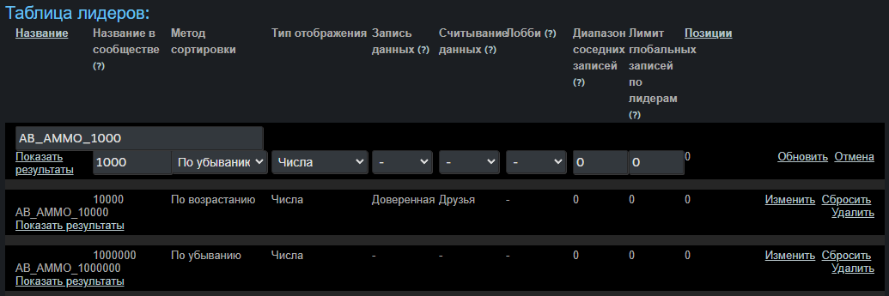

- Следующие поля должны быть заполнены при создании таблицы лидеров:
  - **Название** - Используйте то, которое имеет смысл с точки зрения разработки.
  - **Название в сообществе** - Если таблица лидеров будет отображаться в центре сообщества, задайте здесь общедоступное название. Если ничего не ввести, таблица лидеров не появится в центре сообщества.
  - **Метод сортировки** - Выберите подходящий для данной таблицы лидеров: для таблиц, основанных на месте игрока, используйте метод «По возрастанию», а для основанных на счёте — «По убыванию».
  - **Тип отображения** - Определяет тип данных, показываемых с таблицей лидеров. Варианты: числа, секунды или миллисекунды.
  - **Запись данных** - Если установить значение «Доверенная», клиенты не смогут отправлять данные об очках в таблицы лидеров, это можно будет сделать только с помощью веб-API SetLeaderboardScore. Стандартное значение — false.
  - **Считывание данных** - Если установить значение «Друзья», игра сможет считывать данные таблицы лидеров только для друзей пользователя, но полные данные таблицы всегда можно будет прочесть с помощью веб-API. Стандартное значение — false.

```info
Таблица лидеров сообщества не будет отображаться, если вы оставите поле `« Название сообщества »` пустым.
```

</details>

---

## Настройте достижение :

<details>
    <summary>⚠️ ОПИСАНИЕ: </summary>

- Достижения обладают следующими свойствами:
  - **ID** — автоматически генерируемый номер для каждого достижения.
  - **Название для API** — строка, используемая API при доступе к этому достижению.
  - **Прогресс статистики** — отсылает к статистике, используемой в сообществе как индикатор прогресса для этого достижения. Достижение автоматически разблокируется, если статистика достигает значения разблокировки.
  - **Название для отображения** — это название показывается в уведомлениях клиента и в сообществе. Может быть локализовано.
  - **Описание** — описание достижения, которое показывается в сообществе. Может быть локализовано.
  - **Установлено** — показывает, кто может разблокировать достижение. По умолчанию — клиент. Больше информации здесь.
  - **Скрытое?** — если установлено, «скрытое» достижение (совсем) не показывается на странице пользователя в сообществе, пока он не разблокирует его.
  - **Иконка полученного** — показывается, когда достижение получено.
  - **Иконка неполученного** — показывается до тех пор, пока достижение не получено.

### ОГРАНИЧЕНИЯ
- Названия и иконки достижений должны подходить всем возрастам.
- По умолчанию изначально в играх не может быть более 100 достижений. Когда приложению станут доступны функции профиля, вы сможете добавить новые достижения.

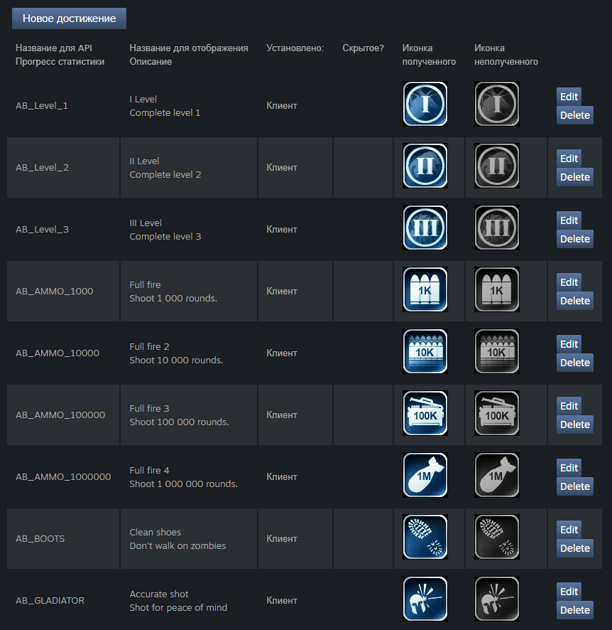

- В разделе `« Прогресс статистики »` из выподающего меню выберети нужную Вам статистику, которую делали ранее.


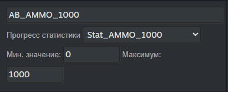

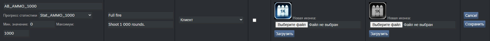

Затем `опубликуйте` эти изменения!
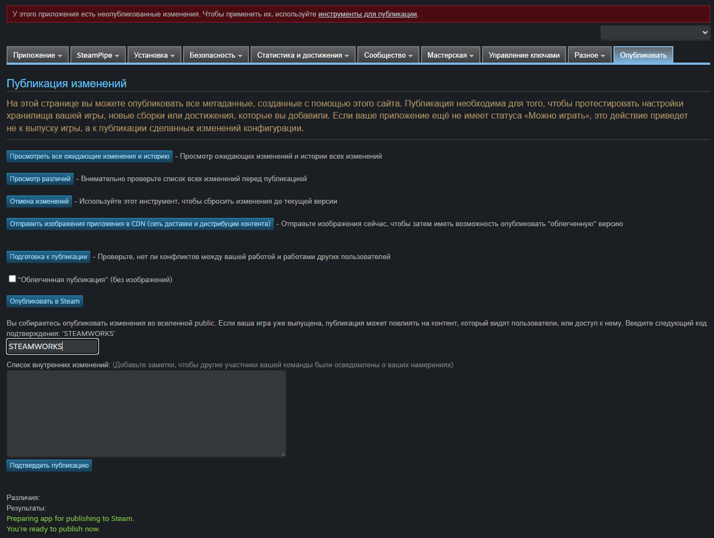

</details>

---
---
---

# ЧЕРТЕЖ
- Чтобы небыло прирывания при подсчёте достижений или статистики особенно при смене сцены, **рекомендую**:
  - писать в `GameInstance`. 
  - Кроме того, события являются `асинхронными`, поэтому они должны находиться в `Event Graph`, не стоит их пихать в функции.
  
**ПЛЮС** - к всему празнику можно получить доступ отовсюду.
**МИНУС** - `GameInstance` имеет свойство разбухать до очень неприличных значений.

Так, что создаём `GameInstance` и вперёд к следующему шагу.

## Статистика чтения:

<details>
    <summary>⚠️ ОПИСАНИЕ: </summary>

В `GameInstanc` на `Event Begin` я вешаю событие с задержкой в ​`​1 секунду` *(без `Delay` быают проскальзования инициализации)*

Тут мы по ивенту считываем текущии значения статистики из `Steam` и сохраняем их в зарание подготовленые переменные в сохранении игры. 

**ПЛЮС** - нам не нужно постоянно дёргать `Steam` чтобы считывать состояния таблицы лидеров *(это связано с тем, что считывание данных таблицы лидеров занимает время, поэтому вызывает трудность делать это на лету. Так же нет контроля над результатом считывания данных успешно или нет, а может скачено частично. Узнаем когда статистика просто не запустится)*. Поэтому мы используем его один раз при каждом запуске игры, этого достаточно.

**МИНУС** - требует написания даполнительной логики

```info
Что бы не словить очередную ошибку не стоит использовать для этого `sequence`. Строим паравозик)))
```

</details>

## Работа с статистикой стим:

<details>
    <summary>⚠️ ОПИСАНИЕ: </summary>


## Статистика в сохранения:

Если вы хотите добавить статистику, сначала запихните данные в `сохранение игры`.

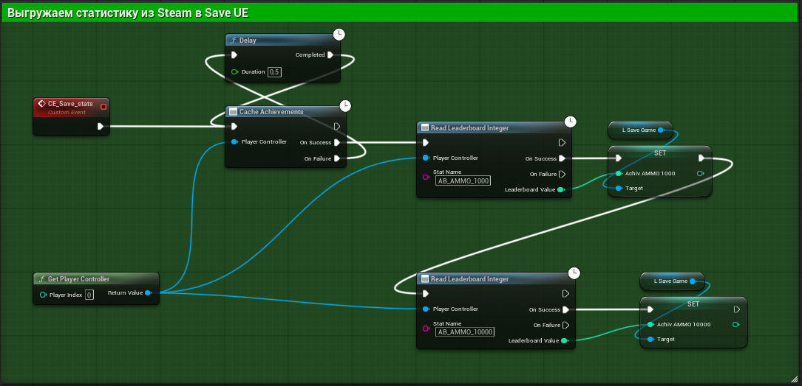


## Изменение статистики:

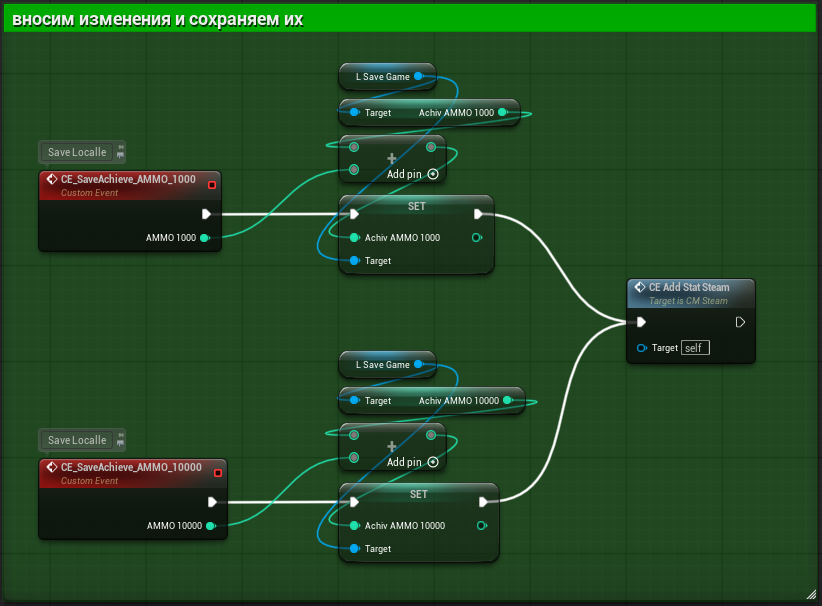
(это только пример)


## Статистика из сохранения:
Затем пришло время загрузить статистику следующим образом.

Не используйте для этого последовательность , так как это приведёт к сбою . Для корректной работы необходимо подключить её, как указано выше. Также убедитесь, что вы НЕ вызываете это событие несколько раз до его завершения. Поэтому лучше всего указать определённую точку, где оно вызывается один раз (например, конец уровня).

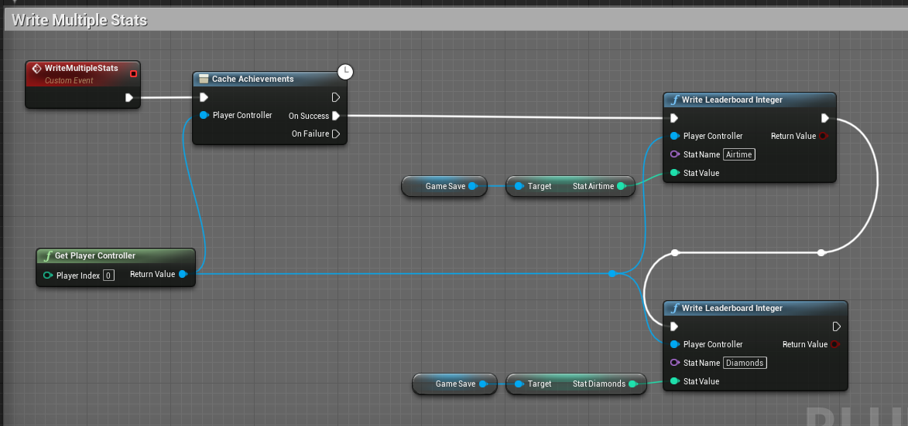


## Результат:

Получив некоторое время эфира в игре, я заканчиваю свой ход, запускаю код, и он загружается в Steam, как показано ниже. (Возможно, вам придется выйти из игры и дать Steam немного загрузиться, прежде чем прогресс отобразится.)

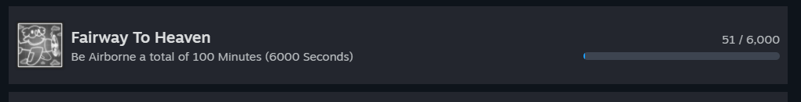
Когда вы достигнете своей цели, достижение автоматически разблокируется.

</details>


## Сброс статистики:

<details>
    <summary>⚠️ ОПИСАНИЕ: </summary>

есть несколько способов сбросить статистику, но в `Blueprint` не так много хороших способов.

- Шаг 1: В `Steamworks > Таблицы лидеров → Просмотреть результаты → Удалить` (вашу запись)
Это решает одну часть, но сама статистика не будет сброшена в вашей учетной записи.

- Шаг 2: Откройте Steam через консоль, введя следующее в поле «Выполнить» `( Win + R )`

```sh
steam://open/console
```

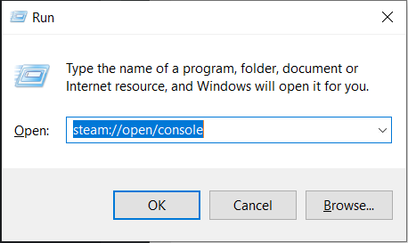

### Откроется окно консоли Steam:
- Чтобы сбросить достижения, `введите` →
```sh
reset_all_stats 480
```
(где 480 — ваш уникальный AppID ).

- Чтобы сбросить определенное достижение, `введите` →

```sh
achievement_clear 480 Achievement_Name
```

Так же можно приписать значения в ярлыке что бы не прописывать постоянно команду

```sh
 - steam://open/console
```

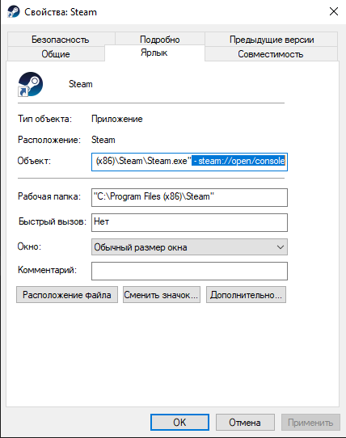

</details>

---
---
---

# Кодовая часть в unreal engine 5 примеры в BP

<details>
    <summary>⚠️ ОПИСАНИЕ: </summary>

## Чтобы `сбросить все достижения` из `Unreal BP`, выполните следующее:

```sh
(online.ResetAchievements)
```

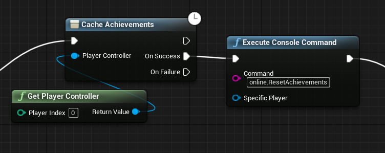


Как уже говорилось, если бы вы отправили прогресс в записи достижений для нескольких достижений за короткий промежуток времени (например, вы совершили 100 убийств, прошли уровень и повысили свой уровень одновременно → 3 достижения), то разблокировалось бы только 1 из них, остальные бы застряли в подвешенном состоянии.

Это один из примеров системы очереди разблокировки достижений .

## В вашем `GameInstance` добавьте следующие переменные :
строковый массив , куда мы добавим идентификаторы достижений для разблокировки
, и логическое значение, чтобы сообщить нам, что процесс идет.


Затем запишите эту систему:

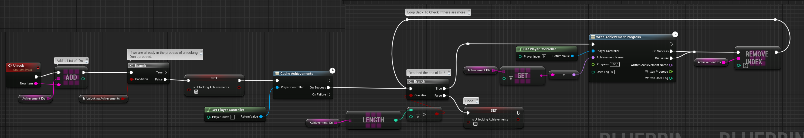

Всякий раз, когда вы вызываете функцию разблокировки идентификатора , он добавляется в массив (в конец).
Затем мы проверяем, является ли оно уже достижением `UnlockingAchievements` (нам не нужно продолжать для достижения `nr2` или `nr3`, так как они уже помещены следующими в очередь в массиве).

Кэшируем достижения один раз, затем проверяем длину массива. Если она равна `0`, то всё готово, и мы сбрасываем `isUnlockingAchievements` . Если она `> 0`, то продолжаем, записываем ход достижения для `Array[0]` и удаляем `Array[0]`. Затем повторяем этот цикл, пока не закончатся идентификаторы массивов.

## Тестирование

Вот как можно разблокировать достижения. Они будут открываться одно за другим.

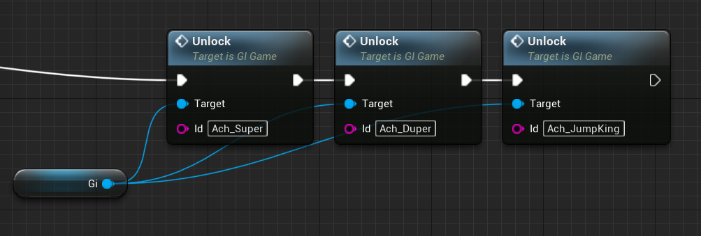

</details>


* * * * * * * * * * * * * * * * * * 
* * * * * * * * * * * * * * * * * * 


## 📜 Лицензия
Этот проект распространяется по [MIT License](/LICENSE).

---

Для детальной документации ознакомьтесь с **------->** [English](/README_en_EN.md) | [Русский](/README.md) **<-------**


